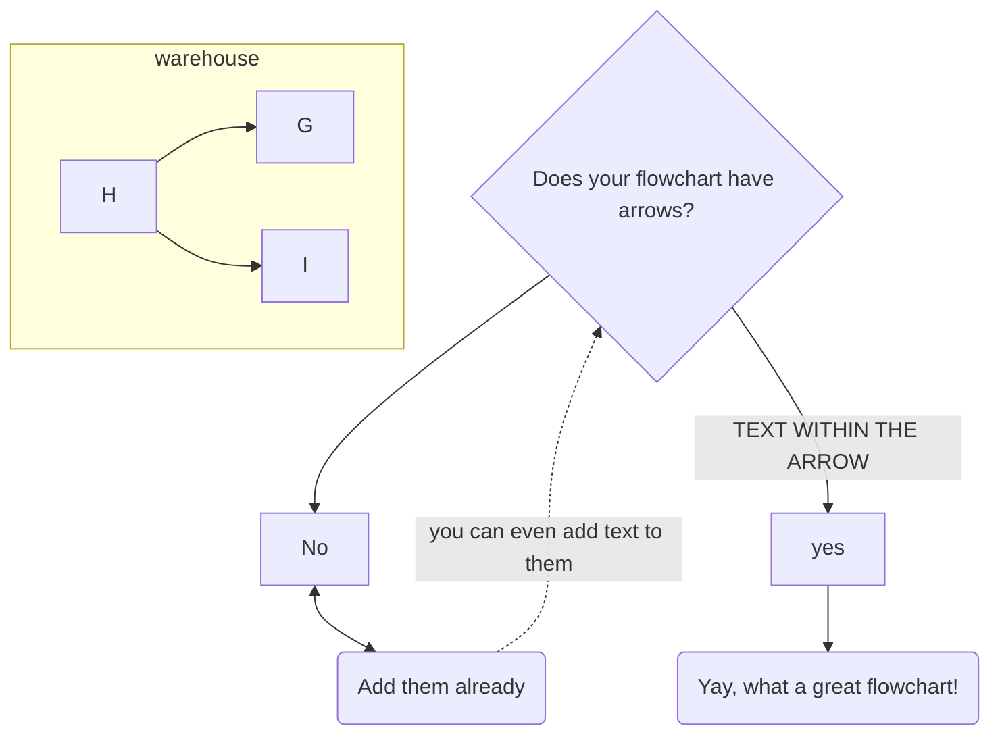
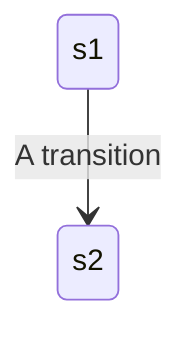
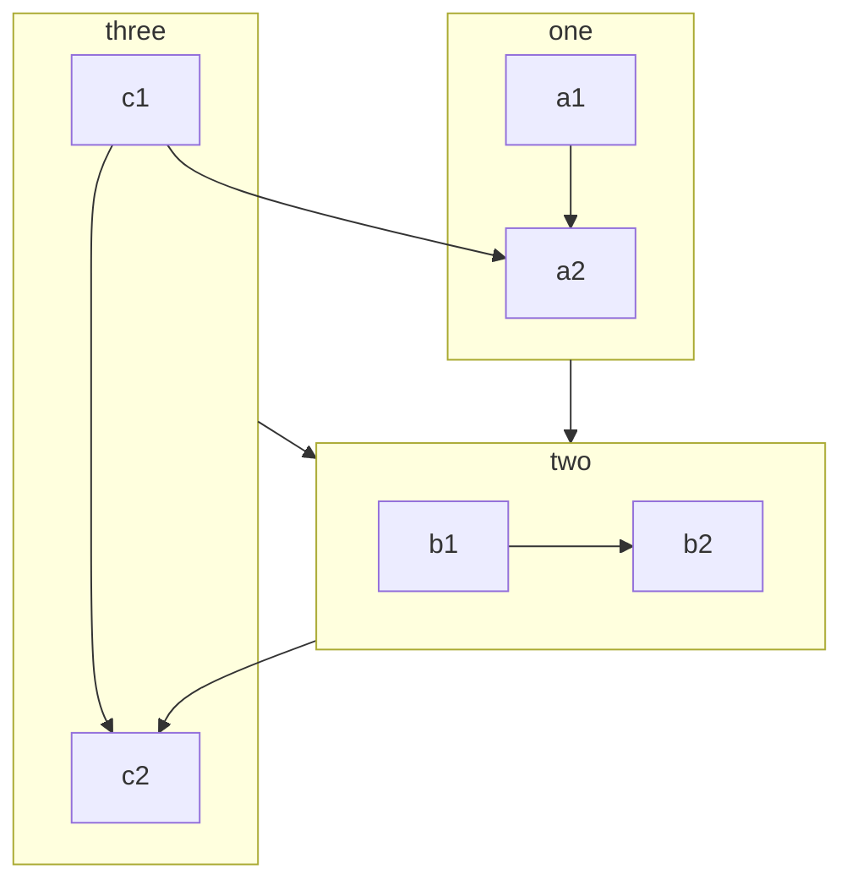
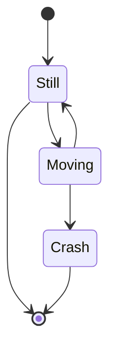
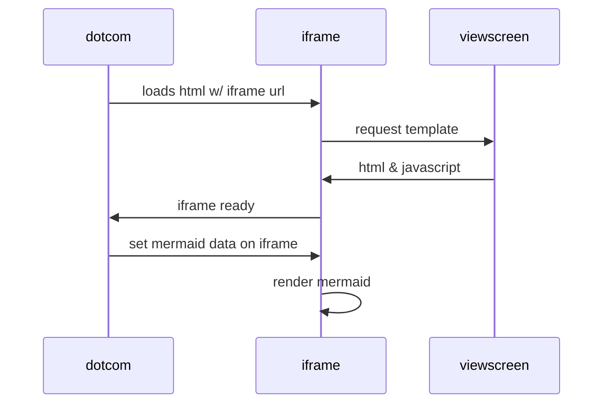
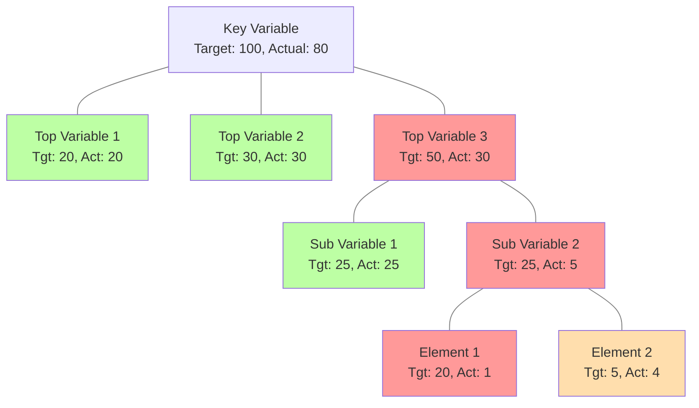

# mymermaid
try out mermaid



# SECOND



# THIRD


# FOUR



# NODES & LINKS


# 6
```mermaid
graph TD
class diagram
  class User {
    +createProject()
    +assignTask()
    +trackProgress()
  }
  class Project {
    +setTitle(title: String)
    +setDescription(desc: String)
  }
  class Task {
    +setTitle(title: String)
    +setDescription(desc: String)
    +setAssignedTo(assignedTo: User)
  }
  class Progress {
    +setPercentage(percentage: Number)
    +setDate(date: Date)
  }
  User --> Project
  User --> Task
  Task --> Progress
```
```mermaid
gantt
axisFormat %e%b
todayMarker on
section Activity 1
    TaskA	: TA, 2021-06-14, 4d
    TaskB	: TB, after TA, 2d
section Activity 2
    TaskC	: TC, after TA, 3d
    TaskD	: TD, after TC, 2d
section Activity 3
    TaskE	: TE, after TD, 1d
    TaskF	: TF, after TE, 2d
